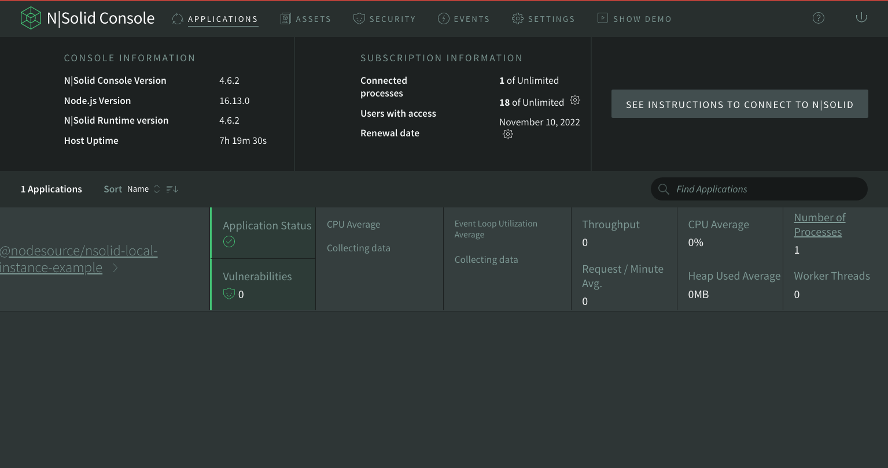

# nsolid-local-instance-example

## Description

After [downloading and installing](https://downloads.nodesource.com/) the N|Solid for Desktop it'll open a communication beetween the Web Console and the nsolid runtime at `localhost:9001`.

It's already added on [package.json](./package.json) section for `command`. There's no need to change it.

## Running

- `npm install`
- `npm start`

Go to your portal at `http://localhost:6753` and you must see a page like as follows:

